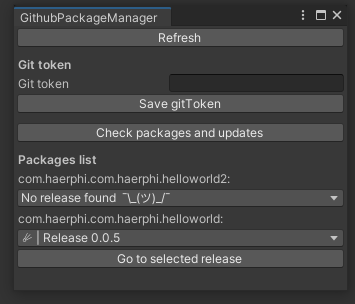

# Unity Github package manager

## Install

- install it throw the Unity package manager

## How to use it ?

- [Setup a personnal Github token](https://docs.github.com/en/authentication/keeping-your-account-and-data-secure/creating-a-personal-access-token)
- Put it in the `Git token` field and click on save
- Once it is done, clik on `Check packages and updates`. The list of all your Package install with Github should appears.
- If there is package with [releases](https://docs.github.com/en/repositories/releasing-projects-on-github/managing-releases-in-a-repository), there will be a list of all the release. ✔ = everything is up to date or ☄️ = can be update
- Once you have selected the release, just click on `Go to the selected release` and it will download the release you selected.
- You may need unfocus/refocus the Unity window to reload the package

## How does it work ?

### Git Token

The git token is save in a variable, it is not saved anywhere for the security of the user.

### Package list and releases

The package list is first setup by checking every package from the [Package Manager list request](https://docs.unity3d.com/ScriptReference/PackageManager.Requests.ListRequest.html) and for each package that came from Github, it do a request on the [Github REST API](https://docs.github.com/en/rest) using the [Git token to login](https://docs.github.com/en/rest/overview/other-authentication-methods).

## In the futur:

- add package field
- auto reload when installing a package
